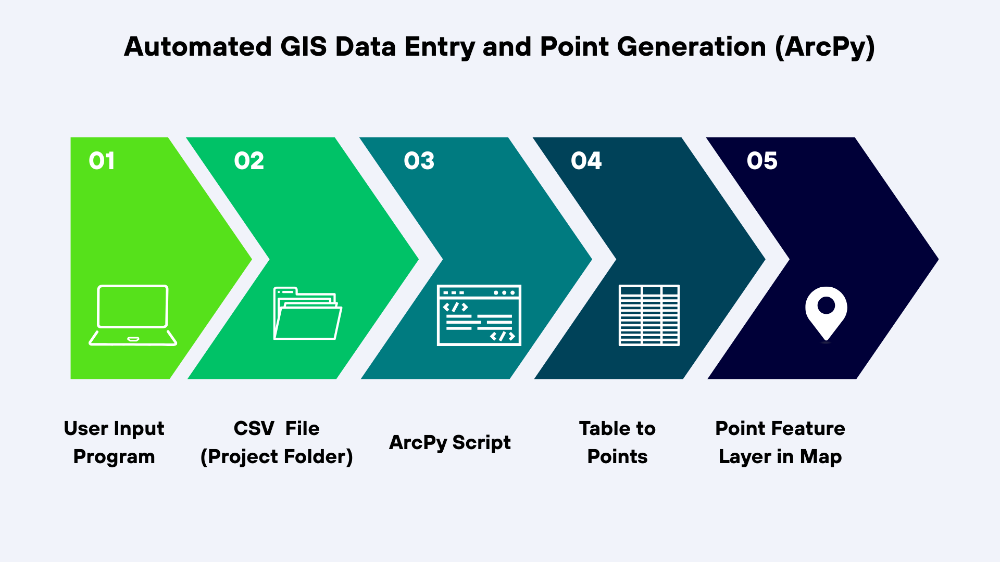

# Automated GIS Data Entry and Point Generation (ArcPy)

## Overview

This project explores how Python can be used to automate repetitive GIS workflows inside ArcGIS Pro.  
The original case study focuses on documenting Romanesque churches in northern Sardinia, but the workflow itself is transferable to many other contexts where spatial data must be recorded manually and converted into map features.

The main goal was to design a simple and reusable process:

data entry program → structured CSV → automated point layer creation.

Once configured, the workflow allows new spatial records to be created and visualized in just a few steps.

## Workflow

1. A Python data entry program allows the user to introduce records with custom attributes and coordinates.
2. The program generates a CSV file stored in the current ArcGIS Pro project directory.
3. An ArcPy script converts the CSV into a point feature layer using XY coordinates.
4. The generated layer is automatically added to the active map.

The scripts interact with the current ArcGIS project to avoid hardcoded paths and make the workflow portable.

## Workflow Diagram

## Features

- User-driven data entry with customizable fields
- Automated CSV generation using Pandas
- Dynamic interaction with the current ArcGIS Pro project
- Automated XY Table to Point conversion with ArcPy
- Reusable workflow adaptable to multiple domains

## Example Applications

Although this project uses cultural heritage data as an example, the same workflow could be used for:

- Forestry inventories (tree species, health, observations)
- Infrastructure inspection and asset tracking
- Field data collection
- Environmental monitoring
- Any object-level spatial data that requires manual attribute recording

## Tech Stack

- Python
- Pandas
- ArcPy
- ArcGIS Pro Notebooks

## How to Run

Recommended setup:

1. Create a notebook inside an ArcGIS Pro project.
2. Run the data entry program to generate the CSV file.
3. Execute the ArcPy script to create the point layer automatically.

Alternatively, an existing CSV can be placed in the project folder and processed directly with the ArcPy script.

## Notes

ArcPy-dependent scripts must be executed inside an ArcGIS Pro environment.
Standalone versions of the program are included for use outside ArcGIS.
